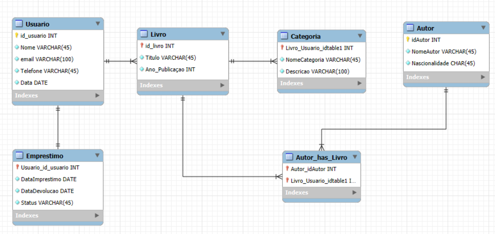

# 📚 Sistema de Biblioteca Online

## 📖 Descrição do Projeto

Este projeto tem como objetivo modelar um sistema de gerenciamento de biblioteca online. O sistema permitirá que usuários realizem empréstimos de livros, categorizem títulos, consultem autores e mantenham o histórico de suas leituras.

O foco está no **modelo conceitual do banco de dados**, que servirá como base para futuras implementações do sistema.

---

---

## 🎯 Objetivos

- Gerenciar usuários cadastrados na biblioteca.
- Controlar o cadastro de livros e suas categorias.
- Permitir o empréstimo e devolução de livros.
- Relacionar livros com seus respectivos autores.

---

## 🗂️ Entidades do Sistema

1. **Usuário**

   - Representa a pessoa cadastrada na biblioteca.
   - Atributos principais: `id_usuario`, `nome`, `email`, `telefone`, `data_cadastro`.

2. **Livro**

   - Representa um livro disponível na biblioteca.
   - Atributos principais: `id_livro`, `titulo`, `ano_publicacao`.

3. **Autor**

   - Representa o autor de um ou mais livros.
   - Atributos principais: `id_autor`, `nome_autor`, `nacionalidade`.

4. **Categoria**

   - Classificação de livros por gênero/assunto.
   - Atributos principais: `id_categoria`, `nome_categoria`, `descricao`.

5. **Empréstimo**
   - Registro do empréstimo de um livro feito por um usuário.
   - Atributos principais: `id_emprestimo`, `data_emprestimo`, `data_devolucao`, `status`.

---

## 🔗 Relacionamentos entre as Entidades

- **Usuário → Empréstimo**

  - Um Usuário pode realizar um único empréstimo.
  - Relacionamento **1:1**.

- **Empréstimo → Livro**

  - Um Empréstimo está associado a apenas um Livro, mas um Livro pode estar em vários Empréstimos ao longo do tempo.
  - Relacionamento **1:N**.

- **Livro → Autor**

  - Um Livro pode ter um ou mais Autores, e um Autor pode escrever vários Livros.
  - Relacionamento **N:M**.

- **Livro → Categoria**
  - Cada Livro pertence a apenas uma Categoria, mas uma Categoria pode ter vários Livros.
  - Relacionamento **1:N**.

---

## ✅ Requisitos Atendidos

- Pelo menos **5 entidades** diferentes.
- Presença de relacionamentos **1:1, 1:N e N:M**:
  - **1:1** → Usuario → Emprestimo.
  - **1:N** → Usuário → Empréstimo, Livro → Categoria.
  - **N:M** → Livro ↔ Autor.

---

## 🛠️ Ferramentas Utilizadas

- **MySQL Workbench** → Criação do modelo conceitual e físico.
- **GitHub** → Versionamento e documentação do projeto.

---

## 👥 Autores

- 👨‍💻 Matheus Henrique Ferreira Braz
- 👩‍💻 Solange Ribeiro da Fonseca

---
